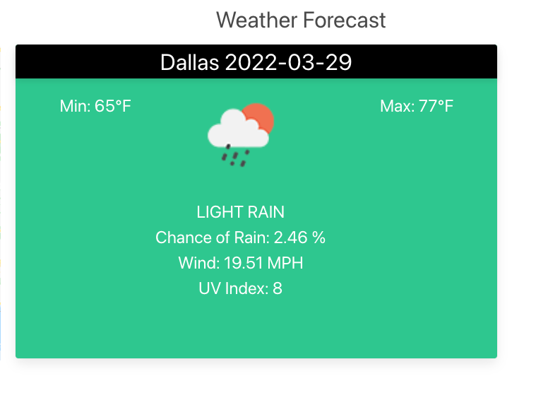

# TripPlanner
A simple app to plan my road trip with help of google maps and weather information

Explore your next trip [here](https://ramumakkena.github.io/TripPlanner/)

### Some screens before you hop on
*   Homepage
  
    

* Defaulting Trip to Today
  
    
* Trip on Planned date
  
    
* Route Map
  
    
* Weather

    
* Popular places
  
    
* Previous Searches
  
    

## Highlights of the application
* Curretnly defaulted home page details to Austin and current day
* Detailed overview of top10 attractions around 10 miles radius at destination from wikipedia
* Weather information at destination for the day trip planned
* Overview of the route over a map with summary of total duration and distance
* A display of latest 10 trips you searched.

## Technologies used
*   HTML
*   Javascript
*   CSS
*   Jquery 
*   Jquery UI
*   Bulma css

## APIs used
*   Google maps API for travel summary and route overview
*   Openweather API for Weather
*   OpenTripMap API for top10 attractions at destination

## Future enhancements
* Providing option to plan trip in future with our 6 days limitation.
* Provide weather for cities along the trip route
* Provide attractions between origin and destination 
* Provide detailed pictures for all the attractions and places along the trip.

## Developers - Team Phoenix
* [Andrew Kim](https://github.com/andrewyk99)
* [Lucio ](https://github.com/Lucio-001)
* [Marco Moya](https://github.com/MarcoMoya1)
* [Ramu Makkena](https://github.com/RamuMakkena)

